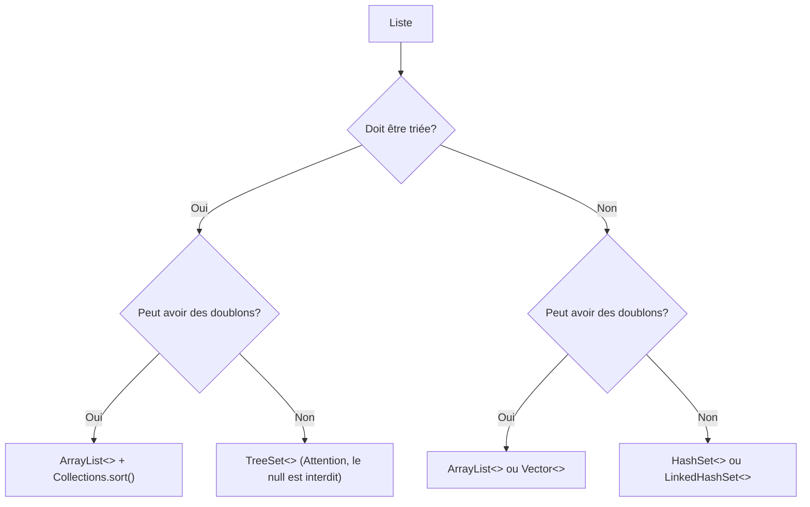

# Les interfaces et le tri avec les listes dynamiques.

## Les interfaces
En Java, une interface est un fichier particulier qui défini un contrat que les classes qui l'implémente doivent respecter. Une interface définit un ensemble de méthodes, mais elle ne fournit pas l'implémentation de celle-ci. Cela permet de créer des classes qui respectent la même nomenclature de méthodes et qui peuvent être interchangeable facilement.

### Caractéristiques principales des interfaces en Java :

**Déclaration des méthodes** : Une interface ne contient que les signatures des méthodes (nom de la méthode, paramètres, et type de retour) sans implémentation.</br>
**Pas d'attributs d'instance** : Contrairement aux classes, les interfaces ne peuvent pas contenir d'attributs d'instance. Elles peuvent cependant contenir des constantes (attributs final et static).</br>
**Héritage multiple** : Une classe peut implémenter plusieurs interfaces, ce qui permet d'avoir un héritage multiple d'interfaces en Java.

### Exemple d'interface :

```java
public interface Animal {
    void manger();
    void dormir();
}
```

Une classe qui doit implémenter cette interface doit le faire grâce au mot-clé **`implements`**. Voici un exemple d'implémentation de l'interface précédement définie :

```java
public class Chien implements Animal {
    @Override
    public void manger() {
        System.out.println("Le chien mange.");
    }

    @Override
    public void dormir() {
        System.out.println("Le chien dort.");
    }
}
```

## Les interfaces pour le tri avec les listes dynamiques.
### L'interface `Comparable`

L'interface Comparable est une interface générique fournie par Java, qui se trouve dans le package `java.lang`. Elle permet de définir de quelle manières les objets doivent être ordrés en implémentant la méthode `compareTo`.

#### Signature de l'interface Comparable :

```java
public interface Comparable<T> {
    int compareTo(T objetAComparer);
}
```
> [!IMPORTANT]  
> Dans cet example le `T` peut prendre la forme de n'importe quel type d'objet.

#### Fonctionnement de la méthode `compareTo` :

- Elle compare l'objet actuel (this) à l'objet spécifié en paramètre (objetAComparer).
- Elle retourne un entier :
  - négatif : si l'objet actuel (this) est "moins que" l'objet comparé (objetAComparer),
  - zéro : si les deux objets sont égaux,
  - positif : si l'objet actuel (this) est "plus que" l'objet comparé (objetAComparer).

#### Exemple d'implémentation avec une classe `Personne` :

Supposons que vous ayez une classe Personne avec un attribut nom et un prenom, et que vous souhaitiez trier les personnes par leur nom par ordre alphabétique.

```java
public class Personne implements Comparable<Personne> {
    private String nom;
    private String prenom;

    public Personne(String nom, String prenom) {
        this.nom = nom;
        this.prenom = prenom;
    }

    public String getNom() {
        return nom;
    }

    public String getPrenom() {
        return prenom;
    }

    @Override
    public int compareTo(Personne autrePersonne) {
        return this.nom.compareTo(autrePersonne.getNom());
    }

    @Override
    public String toString() {
        return nom + " " + prenom;
    }
}
```

#### Utilisation avec une ArrayList :

Une fois l'interface Comparable implémentée, vous pouvez facilement trier une ArrayList de personnes, grâce à la méthode `sort()` se trouvant dans la classe `Collections`:

```java
import java.util.ArrayList;
import java.util.Collections;

public class Main {
    public static void main(String[] args) {
        ArrayList<Personne> personnes = new ArrayList<Personne>();
        personnes.add(new Personne("Poppins", "Marie"));
        personnes.add(new Personne("Voyante", "Claire"));
        personnes.add(new Personne("Dente", "Al"));

        Collections.sort(personnes);

        for (Personne p : personnes) {
            System.out.println(p);
        }
    }
}
```

#### Résultat :

> Dente Al</br>
> Poppins Marie</br>
> Voyante Claire</br>

## ArrayList vs HashSet vs TreeSet

Java met à disposition plusieurs structures de données ayant des comportement différents et utiles dans différentes situations.
`ArrayList` est une liste ordonnée selon l'ordre d'insertion, qui permet les doublons et peut être triée manuellement avec `Collections.sort`, tandis que `HashSet` est un ensemble non ordonné qui ne permet pas les doublons, offrant des performances rapides pour les opérations de base, et `TreeSet` est un ensemble trié automatiquement selon l'ordre défini par le type de donnée des éléments, ne permettant pas les doublons. Le choix entre eux dépend de la nécessité de gérer des doublons, de maintenir un ordre, et des exigences de performance.

Voici un schéma vous aidant a trouver la bonne structure de donnée à utiliser:




# Exercices

## Partie 1 : Utilisation de structure de tri

### Travail à réaliser
- Créez un nouveau projet java.

- Dans la méthode main, utilisez une structure de donnée permettant d'order les éléments suivant par ordre alphabétique et sans doublons:
  - Pomme
  - Banane
  - Orange
  - Pomme
  - Fraise
  - Banane
  - Raisin
  - Orange
  - Pomme
  - Banane

> [!NOTE]  
> Vous devez ajouter les éléments dans votre liste dans l'ordre donné ci-dessus.

### Résultat attendu

> Banane </br>
> Fraise </br>
> Orange </br>
> Pomme </br>
> Raisin </br>

## Partie 2 : L'interface Comparable

### Travail à réaliser
- Toujours dans le même projet
- Ajoutez une classe représentant des `Fruit`, qui sera définie par les attributs et méthodes suivants:
  - Un nom en String
  - Un nombre de graine en int
  - S'il est comestible en boolean
  - Les getters pour les différents attributs
  - La méthode compareTo:
    - Ordre les fruits par nombre croissant de graîne et s'il y a une égalité, par ordre alphabétique.
  - La méthode toString:
    - Le nom du fruits, suivi du nombre de graines entre parenthèses, suivi d'une * s'il n'est pas commestible. (par ex. "Pomme (4)" ou "Solanum(50)*")
- Dans la méthode main, créez les objets fruits suivant cette liste : 
  - Pomme - Graines : 4, Comestible : Oui
  - Banane - Graines : 0, Comestible : Oui
  - Manchineel - Graines : 333, Comestible : Non
  - Orange - Graines : 10, Comestible : Oui
  - Pomme - Graines : 4, Comestible : Oui
  - Fraise - Graines : 200, Comestible : Oui
  - Banane - Graines : 0, Comestible : Oui
  - Solanum - Graines : 50, Comestible : Non
  - Raisin - Graines : 4, Comestible : Oui
  - Orange - Graines : 10, Comestible : Oui
  - Pomme - Graines : 4, Comestible : Oui
  - Banane - Graines : 0, Comestible : Oui
- Ajoutez les objets dans une liste pour qu'il soit trié comme implémenté dans la classe `Fruit` les doublons sont autorisés.

### Résultat attendu

> Banane (0)</br>
> Banane (0) </br>
> Banane (0) </br>
> Pomme (4) </br>
> Pomme (4) </br>
> Pomme (4) </br>
> Raisin (4) </br>
> Orange (10) </br>
> Orange (10) </br>
> Solanum (50)* </br>
> Fraise (200) </br>
> Manchineel (333)* </br>

## Partie 2' - Optionnel
Changez l'ordre de tri pour que les fruits non comestible soit en premier dans la liste s'il y a égalité il faut que le fruit soit trié par nombre de graines et ensuite par ordre alphabétique.

### Résultat attendu
> Solanum (50)*  </br>
> Manchineel (333)* </br>
> Banane (0) </br>
> Banane (0) </br>
> Banane (0) </br>
> Pomme (4) </br>
> Pomme (4) </br>
> Pomme (4) </br>
> Raisin (4) </br>
> Orange (10) </br>
> Orange (10) </br>
> Fraise (200) </br>

## Partie 3 : Le Comparator

Pour les plus observateurs, vous avez pu remarquer qu'il y a 2 méthodes `sort()` dans la classe `Collections`.
La premières implémentation que vous avez normalement du utiliser dans la partie 2
```java
Collections.sort(List<T> list);
```
> [!IMPORTANT]  
> Dans cet example le `T` peut prendre la forme de n'importe quel type d'objet.

La deuxième implémentation ajoute un `Comparator`:
```java
Collections.sort(List<T> list, Comparator<T> c);
```
Le `Comparator` permet de définir des critères de tri différents pour une même classe, sans modifier le code de la classe elle-même. La méthode `Collections.sort(...)` utilise le `Comparator` passé en paramètre pour trier la liste selon l'ordre spécifié. 

Le `Comparator` doit implémenter la méthode `compare(T o1, T o2)` qui retourne un entier : 
- un nombre négatif si le premier objet doit précéder le second
- zéro s'ils sont égaux
- un nombre positif si le premier objet doit suivre le second.

L'utilisation d'un `Comparator` est particulièrement utile lorsqu'on souhaite trier des objets selon différents critères que ceux implémenté dans la classe ou lorsque la classe des objets à trier ne peut pas être modifiée pour implémenter `Comparable`.

### Exemple
Si l'on reprend la classe `Personne` vu plus haut, nous voyons dans la méthode `compareTo` que les objets `Personne` seront trié par leur nom. Exceptionnellement dans notre méthode main nous voulons les ordrer par prénom. Nous allons donc changer le comportement par défaut avec notre tri:

```java
import java.util.ArrayList;
import java.util.Collections;

public class Main {
    public static void main(String[] args) {
        ArrayList<Personne> personnes = new ArrayList<Personne>();
        
        personnes.add(new Personne("Poppins", "Marie"));
        personnes.add(new Personne("Voyante", "Claire"));
        personnes.add(new Personne("Dente", "Al"));

        Collections.sort(personnes, new Comparator<Personne>()) {

            @Override
            public int compare(Personne personne1, Personne personne2) {
                return personne1.getPrenom().compareTo(personne2.getPrenom());
            }
        }

        for (Personne p : personnes) {
            System.out.println(p);
        }
    }
}
```

#### Résultat :

> Dente Al</br>
> Voyante Claire</br>
> Poppins Marie</br>

### Travail à réaliser

- Reprennez le programme de la partie 2
- Implementez un tri pour vos fruits pour que exceptionnellement ils soit trié uniquement par ordre alphabétique.

### Résultat attendu

> Banane (0) </br>
> Banane (0)</br>
> Banane (0)</br>
> Fraise (200)</br>
> Manchineel (333)* </br>
> Orange (10)</br>
> Orange (10)</br>
> Pomme (4)</br>
> Pomme (4)</br>
> Pomme (4)</br>
> Raisin (4)</br>
> Solanum (50)* </br>
