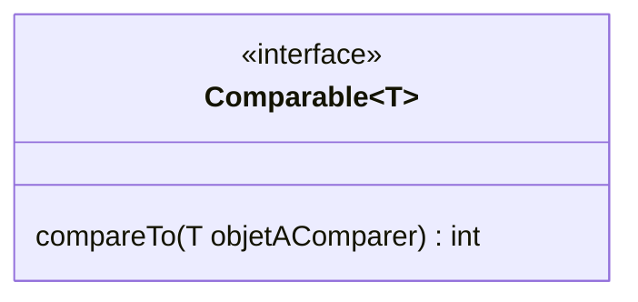
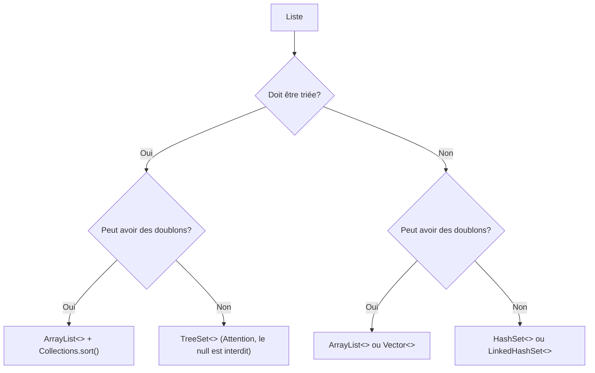

# Les interfaces et le tri avec les listes dynamiques.

## Les interfaces
En Java, une interface est un fichier particulier qui définit un contrat que les classes qui l'implémentent doivent respecter. Une interface définit un ensemble de méthodes, mais elle ne fournit pas l'implémentation de celle-ci. Cela permet de créer des classes qui respectent la même nomenclature de méthodes et qui peuvent être interchangeables facilement.

On peut voir une interface comme un "savoir-faire", et les classes qui implémentent cette interface s'engagent à réaliser ce "savoir-faire".

### Caractéristiques principales des interfaces en Java :

**Déclaration des méthodes** : Une interface ne contient que les signatures des méthodes (nom de la méthode, paramètres, et type de retour) sans implémentation.</br>
**Pas d'attributs d'instance** : Contrairement aux classes, les méthodes listées dans les interfaces ne doivent pas contenir d'attributs d'instance (public, private, ...). Elles peuvent cependant contenir des déclarations de constantes (avec les attribus `public`, `final` et `static`).</br>
**Implémentation multiple** : une classe peut implémenter plusieurs interfaces (plusieurs savoir-faires) mais ne peut hériter que d'une seule (is-a).

### Exemple d'interface :

```java
public interface Animal {
    void manger();
    void dormir();
}
```

Une classe qui doit implémenter cette interface doit le faire grâce au mot-clé **`implements`**. Voici un exemple d'implémentation de l'interface précédemment définie :

```java
public class Chien implements Animal {
    @Override
    public void manger() {
        System.out.println("Le chien mange.");
    }

    @Override
    public void dormir() {
        System.out.println("Le chien dort.");
    }
}
```

## Les interfaces pour le tri avec les listes dynamiques.

Pour pouvoir trier des choses, il faut nécessairemnt pouvoir les comparer entre-elles. On pourra ainsi déterminer laquelle vient avant, vient après, ... en comparant ces choses entre-elles.

Java souhaitant dès sa création mettre à disposition des outils pour trier et des collections triées, s'est trouvée dans la même situation. Or on ne compare pas de la même façon deux nombres, deux chaînes de caractères, deux vélos, deux girafes, ... sans parler que cela peut changer d'une fois à l'autre (on peut vouloir trier des voitures par km, et une autre fois par prix).

La solution élégante trouvée et utilisée dans de nombreux languages est de laisser ce travail de se comparer à d'autres comme nous à la classe elle-même, seule à savoir le faire (l'interface `Comparable` présentée ci-dessous).

Ainsi, pour votre classe TrucMachinChose, l'implementation facile de ce "savoir-faire" vous permettra d'ensuite demander à Java de vous trier et d'automatiquement bénéficier de centaines de classes qui sauront en tirer profit automatiquement (des collections de TrucMachinChose automatiquement triées, ...).

### L'interface `Comparable`

L'interface Comparable est une interface générique fournie par Java, qui se trouve dans le package `java.lang`. Elle permet de définir de quelle manière les objets doivent être ordrés en implémentant la méthode `compareTo`.

#### Signature de l'interface Comparable :


```java
public interface Comparable<T> {
    int compareTo(T objetAComparer);
}
```
> [!IMPORTANT]  
> Dans cet example le `T` peut prendre la forme de n'importe quel type d'objet.

#### Fonctionnement de la méthode `compareTo` :

- Elle compare l'objet actuel (this) à l'objet spécifié en paramètre (objetAComparer).
- Elle retourne un entier :
  - négatif : si l'objet actuel (this) est "moins que" l'objet comparé (objetAComparer)
  - zéro : si les deux objets sont égaux
  - positif : si l'objet actuel (this) est "plus que" l'objet comparé (objetAComparer)

#### Exemple d'implémentation avec une classe `Personne` :

Supposons que vous ayez une classe Personne avec un attribut nom et un prénom, et que vous souhaitiez trier les personnes par leur nom par ordre alphabétique.

```java
public class Personne implements Comparable<Personne> {
    private String nom;
    private String prenom;

    public Personne(String nom, String prenom) {
        this.nom = nom;
        this.prenom = prenom;
    }

    public String getNom() {
        return nom;
    }

    public String getPrenom() {
        return prenom;
    }

    @Override
    public int compareTo(Personne autrePersonne) {
        return this.nom.compareTo(autrePersonne.getNom());
    }

    @Override
    public String toString() {
        return nom + " " + prenom;
    }
}
```

> [!IMPORTANT]  
> Toutes les classes de Java comme `String`, les wrappers `Ìnteger`, `Double`, ... implémentent déjà l'interface Comparable.
> C'est la raison pour laquelle on peut facilement leur déléguer cette tâche de comparaison comme ci-dessus.
> En gros, si vous voulez 'choses', demandez à l'une de se comparer à l'autre !

#### Utilisation avec une ArrayList :

Une fois l'interface `Comparable` implémentée, vous pouvez facilement trier une ArrayList de personnes, grâce à la méthode `sort()` se trouvant dans la classe `Collections`:

```java
import java.util.ArrayList;
import java.util.Collections;

public class Main {
    public static void main(String[] args) {
        ArrayList<Personne> personnes = new ArrayList<Personne>();
        personnes.add(new Personne("Poppins", "Marie"));
        personnes.add(new Personne("Voyante", "Claire"));
        personnes.add(new Personne("Dente", "Al"));

        Collections.sort(personnes);

        for (Personne p : personnes) {
            System.out.println(p);
        }
    }
}
```

#### Résultat sur la console :

```text
Dente Al</br>
Poppins Marie</br>
Voyante Claire</br>
```

## ArrayList vs HashSet vs TreeSet

Java met à disposition de très nombreuses structures de données ayant des comportements différents et utiles dans différentes situations (mais nous allons revenir là-dessus plus en détail dans une prochaine activité).

Par exemple :
- `ArrayList` qui est une liste non ordonnée, respectant l'ordre d'insertion, permettant des doublons, pouvant être triée avec `Collections.sort`
- `HashSet` qui est un ensemble non ordonné, ne permettant pas les doublons, offrant des performances rapides pour les opérations de base
- `TreeSet` qui est un ensemble trié automatiquement selon les éléments contenus (leur implémentation de `Comparable`), ne permettant pas les doublons

Le choix entre l'une ou l'autre dépendra de la nécessité de gérer des doublons, de maintenir un ordre, des exigences de performance, ...

Voici un schéma vous aidant a trouver la bonne structure de donnée à utiliser pour gérer une liste :



# Exercices

## Partie 1 : Utilisation de structure de tri

### Travail à réaliser
- Créez un nouveau projet java.

- Dans la méthode main, utilisez une structure de donnée permettant d'order les éléments suivants par ordre alphabétique et sans doublons:
  - Pomme
  - Banane
  - Orange
  - Pomme
  - Fraise
  - Banane
  - Raisin
  - Orange
  - Pomme
  - Banane

> [!NOTE]  
> Vous devez ajouter les éléments dans votre liste dans l'ordre donné ci-dessus.

### Résultat attendu sur la console

```
Banane </br>
Fraise </br>
Orange </br>
Pomme </br>
Raisin </br>
```

## Partie 2 : L'interface Comparable

### Travail à réaliser
- Toujours dans le même projet
- Ajoutez une classe représentant des `Fruit`, qui sera définie par les attributs et méthodes suivants:
  - Un nom en String
  - Un nombre de graine en int
  - S'il est comestible en boolean
  - Les getters pour les différents attributs
  - La méthode compareTo:
    - Ordonne les fruits par nombre croissant de graînes et s'il y a une égalité, par ordre alphabétique.
  - La méthode toString:
    - Le nom du fruits, suivi du nombre de graines entre parenthèses, suivi d'une * s'il n'est pas comestible. (par ex. "Pomme (4)" ou "Solanum(50)*")
- Dans la méthode main, créez les objets fruits suivant cette liste : 
  - Pomme - Graines : 4, Comestible : Oui
  - Banane - Graines : 0, Comestible : Oui
  - Manchineel - Graines : 333, Comestible : Non
  - Orange - Graines : 10, Comestible : Oui
  - Pomme - Graines : 4, Comestible : Oui
  - Fraise - Graines : 200, Comestible : Oui
  - Banane - Graines : 0, Comestible : Oui
  - Solanum - Graines : 50, Comestible : Non
  - Raisin - Graines : 4, Comestible : Oui
  - Orange - Graines : 10, Comestible : Oui
  - Pomme - Graines : 4, Comestible : Oui
  - Banane - Graines : 0, Comestible : Oui
- Ajoutez les objets dans une liste pour qu'il soit trié comme implémenté dans la classe `Fruit` les doublons sont autorisés.

### Résultat attendu sur la console

```
Banane (0)</br>
Banane (0) </br>
Banane (0) </br>
Pomme (4) </br>
Pomme (4) </br>
Pomme (4) </br>
Raisin (4) </br>
Orange (10) </br>
Orange (10) </br>
Solanum (50)* </br>
Fraise (200) </br>
Manchineel (333)* </br>
```

## Partie 2' - Optionnel

Changez l'ordre de tri pour que les fruits non comestibles soient en premier dans la liste s'il y a égalité il faut que le fruit soit trié par nombre de graines et ensuite par ordre alphabétique.

### Résultat attendu sur la console

```
Solanum (50)*  </br>
Manchineel (333)* </br>
Banane (0) </br>
Banane (0) </br>
Banane (0) </br>
Pomme (4) </br>
Pomme (4) </br>
Pomme (4) </br>
Raisin (4) </br>
Orange (10) </br>
Orange (10) </br>
Fraise (200) </br>
```

## Partie 3 : Le Comparator

Pour les plus observateurs, vous avez pu remarquer qu'il y a 2 méthodes `sort()` dans la classe `Collections`.

La premières implémentation que vous avez normalement du utiliser dans la partie 2
```java
Collections.sort(List<T> list);
```
> [!IMPORTANT]  
> Dans cet exemple le `T` peut prendre la forme de n'importe quel type d'objet.

Et la deuxième implémentation, une surcharge qui ajoute un `Comparator`:
```java
Collections.sort(List<T> list, Comparator<T> c);
```
Le `Comparator` permet de définir des critères de tri différents par rapport au comportement par défaut de la classe (= son implémentation de `Comparable`). Et ce sans avoir modifier le code de la classe elle-même, car celui-ci sera fourni directement "à la volée". La méthode `Collections.sort(...)` utilise une implémentation de `Comparator` directement passée en paramètre afin de trier la liste selon ces nouvelles règles-là. 

Ce `Comparator` doit implémenter la méthode `compare(T o1, T o2)` qui retourne un entier : 
- un nombre négatif si le premier objet doit précéder le second
- zéro s'ils sont égaux
- un nombre positif si le premier objet doit suivre le second.

L'utilisation d'un `Comparator` est particulièrement utile lorsqu'on souhaite trier des objets selon différents critères que ceux implémentés dans la classe ou lorsque la classe des objets à trier ne peut pas être modifiée (on ne peut pas changer son implémentation de `Comparable`).

### Exemple

Si l'on reprend la classe `Personne` vue plus haut, nous voyons dans la méthode `compareTo` que les objets `Personne` seront trié par leur nom. Exceptionnellement dans notre méthode main nous voulons les ordrer par prénom. Nous allons donc changer le comportement par défaut avec notre tri:

```java
import java.util.ArrayList;
import java.util.Collections;

public class Main {
    public static void main(String[] args) {
        ArrayList<Personne> personnes = new ArrayList<Personne>();
        
        personnes.add(new Personne("Poppins", "Marie"));
        personnes.add(new Personne("Voyante", "Claire"));
        personnes.add(new Personne("Dente", "Al"));

        Collections.sort(personnes, new Comparator<Personne>() {

            @Override
            public int compare(Personne personne1, Personne personne2) {
                return personne1.getPrenom().compareTo(personne2.getPrenom());
            }
        });

        for (Personne p : personnes) {
            System.out.println(p);
        }
    }
}
```

#### Résultat attendu sur la console

```
Dente Al</br>
Voyante Claire</br>
Poppins Marie</br>
```

### Travail à réaliser

- Reprenez le programme de la partie 2
- Implémentez un tri pour vos fruits pour que exceptionnellement ils soit trié uniquement par ordre alphabétique.

#### Résultat attendu sur la console

```
Banane (0) </br>
Banane (0)</br>
Banane (0)</br>
Fraise (200)</br>
Manchineel (333)* </br>
Orange (10)</br>
Orange (10)</br>
Pomme (4)</br>
Pomme (4)</br>
Pomme (4)</br>
Raisin (4)</br>
Solanum (50)* </br>
```
